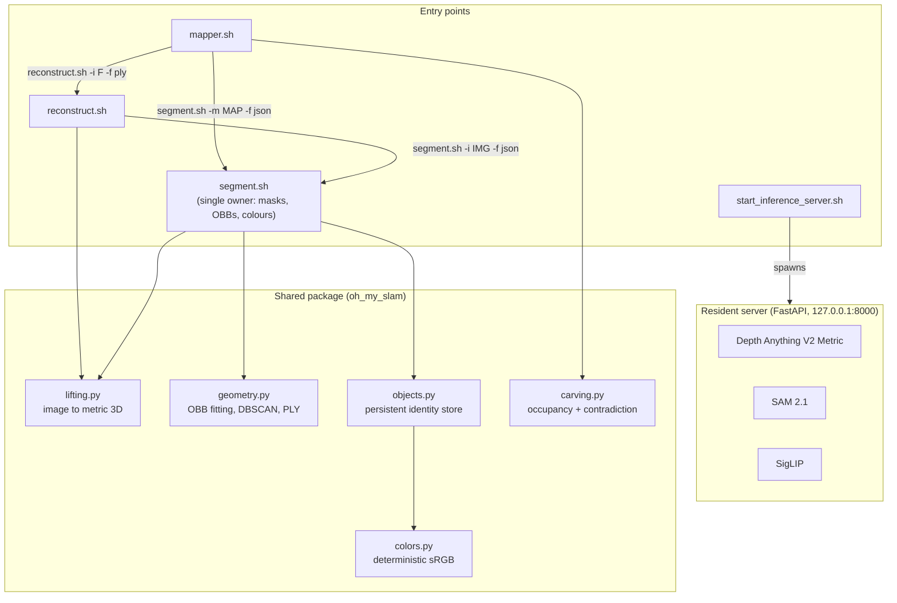

# Track B Architecture Plan: Metric-Depth-Anchored Dense Reconstruction

**Document Path:** `plan-b.md`
**Specification Reference:** `high_level_spec.md`
**Target Hardware:** Apple Silicon M4 (macOS arm64, unified memory, Metal Performance Shaders)
**Package & Runtime Manager:** `uv` (`.venv`, Python 3.11–3.12)
**Scene Schema:** ASAM OpenLABEL v1.0.0 (shared across tracks A, B and C)

---

## 1. Paradigm & Scope

Track B reconstructs metric 3D directly from monocular RGB by anchoring every frame to an
**absolute metric depth prior**, then fusing frames into a persistent, semantically labelled
volumetric map.

Four ideas define the track:

1. **Metric-first geometry.** A monocular metric depth model (Depth Anything V2 Metric) predicts
   depth in real metres, so a single image already yields a correctly scaled point cloud. Scale is
   never estimated from motion, which is what makes single-frame reconstruction (`reconstruct.sh -i`)
   a first-class operation rather than a degenerate case of mapping.
2. **Dense registration.** Frames are aligned by dense point-to-point ICP over the full lifted
   cloud, not by sparse keypoint matching. Textureless walls and repetitive patterns, which
   starve ORB/SIFT, still provide geometry to register against.
3. **Temporal contradiction handling.** The map is an occupancy grid, not an append-only point
   pile. A new view that sees *through* where a point used to be carves that point away, which is
   what makes the map current rather than cumulative (spec §2.3).
4. **Persistent semantic identity.** Objects live in a store that outlives any single run. An
   object seen from six angles, or seen again next week, keeps one `id` and one colour.

### 1.1 What Track B deliberately is not

This plan previously described a feed-forward pointmap-regression architecture built on
MASt3R/DUSt3R. That was re-baselined: the implementation never used MASt3R, and the claimed
benchmark advantages were never realised in this codebase. Cross-view pose here comes from ICP
over metric depth. The trade-off is stated plainly in §9.

---

## 2. Component Selection

| Subsystem | Choice | Why this one | Measured on M4, 1920×1080, warm server |
| :--- | :--- | :--- | :--- |
| **Metric depth** | Depth Anything V2 Metric (Indoor, Small, `-hf`) | Predicts absolute metres rather than relative inverse depth, which is what removes monocular scale ambiguity without a second view. The Small variant keeps the resident footprint low; Base/Large are drop-in upgrades via one constant. | **0.09 s** per frame, server-side incl. resize + base64 encode |
| **Instance masks** | SAM 2.1 Hiera-Large | Class-agnostic, promptable, and does not require the vocabulary to be fixed at training time. Produces whole-object masks rather than semantic blobs. | **2.07 s** per frame for SAM 2 + batched SigLIP together (~90 masks); not split further |
| **Open-vocabulary labels** | SigLIP `base-patch16-256` | Strong zero-shot classifier whose sigmoid head gives a genuine "does this crop match this label" probability, independent of the candidate list. Scoring uses both that and a softmax — see §5.4. | included in the 2.07 s above. Batching all crops per call took this endpoint from 6.05 s to 2.07 s |
| **Outlier rejection** | Open3D DBSCAN (`eps=0.05 m`, `min_points=15`) | Mask edges bleed onto the background; those points sit metres behind the object and would inflate the OBB to reach them. Density clustering separates them without eroding the silhouette. | not measured |
| **OBB fitting** | Open3D minimal-volume OBB (convex hull + rotating calipers) | A PCA box is axis-aligned to the point distribution, not to the object, and over-covers non-uniformly sampled clusters. Minimal-volume gives a tight, physically meaningful W×H×D. | not measured |
| **Pose estimation** | Open3D point-to-point ICP over the dense lifted cloud | Uses all the geometry, not a sparse subset. Honest limitation: no loop closure, so error accumulates along a trajectory (§9). | not measured |

Model identifiers live in `server/daemon.py` as `DEPTH_MODEL_ID`, `SAM2_MODEL_ID` and
`SIGLIP_MODEL_ID`. The measured figures are wall-clock on this M4 with the server warm and nothing
else running, from `/usr/bin/time` around `curl` against the endpoints and around the CLIs;
"not measured" means exactly that and no estimate is offered in its place. End to end,
`reconstruct.sh -f ply` is **0.44 s** and `segment.sh -i` is **2.99 s** for a 1920×1080 frame. An
earlier revision of this plan cited 26 s for `reconstruct.sh`; that number was taken while another
client held the inference lock and measured queueing, not work. Accuracy benchmarking remains
outstanding (§10).

---

## 3. Topology & Delegation

Spec §4 fixes the ownership rules, and the code enforces them by calling the neighbouring shell
script rather than re-implementing its logic:

1. `mapper.sh` delegates per-frame depth and point clouds to `reconstruct.sh -i <frame> -f ply`.
2. `reconstruct.sh -f json` delegates objects and OBBs to `segment.sh -i <image> -f json` and
   returns that scene description unchanged.
3. `segment.sh` is the **single owner** of segmentation, 3D lifting of masks, DBSCAN filtering,
   OBB fitting and colour assignment.
4. All four entry points talk to the resident inference server and fail fast if it is down.



### 3.1 Shared code, one implementation each

Spec §4 forbids duplicated logic. Each of these lives in exactly one module:

| Concern | Module | Used by |
| :--- | :--- | :--- |
| Image → metric 3D point cloud | `lifting.py` | `reconstruct`, `segment` |
| OBB fitting, DBSCAN, PLY I/O | `geometry.py` | `segment` |
| OpenLABEL emission, cuboid and quaternion encoding | `schema.py` | `segment`, `mapper`, viewer |
| Object identity, merging, persistence | `objects.py` | `segment`, `mapper` |
| Occupancy, carving, contradiction verdicts | `carving.py` | `mapper` |
| Colour from object id | `colors.py` | `segment`, viewer |
| Coordinate frames and intrinsics | `coordinate.py` | everything |
| Virtualenv check, MPS flag, `PYTHONPATH` | `scripts_common.sh` | all four `.sh` entry points |

---

## 4. Coordinate Contract

* **Units:** metres. `1.0` is one metre of physical space.
* **Frame:** right-handed, **+y up**, **+x right**, **−z forward** (OpenGL / glTF).
* Depth unprojection produces OpenCV Right-Down-Forward coordinates, converted once by
  `R_cv→gl = diag(1, −1, −1)` in `coordinate.cv_to_gl_points`. Poses use the similarity transform
  `R_gl = R_cv→gl · R_cv · R_cv→gl` (the matrix is its own inverse).
* Every downstream artefact — PLY, OBB, JSON, viewer — is in this one frame. Nothing re-converts.

---

## 5. Components

### 5.1 `start_inference_server.sh`

FastAPI + uvicorn on `127.0.0.1:8000`; PID in `/tmp/oh_my_slam_server.pid`, log in
`/tmp/oh_my_slam_server.log`. `-f`/`--foreground` runs it attached.

Endpoints:

| Endpoint | Returns |
| :--- | :--- |
| `GET /health` | device, loaded model ids |
| `POST /infer/reconstruct` | intrinsics + metric depth as **base64 float16** |
| `POST /infer/segment_classify` | instances with **run-length-encoded** masks, labels, scores |

Both payload encodings are deliberate. A 640×480 depth map as a JSON float list is ~6 MB of
decimal text per frame; as base64 float16 it is ~600 KB, and float16 quantisation stays under a
centimetre out to 50 m — finer than the depth model's own error. Masks travel as RLE over the
flattened mask for the same reason: a large instance costs a few hundred integers instead of
hundreds of thousands.

**SigLIP is batched.** Classifying each mask with its own forward pass was the dominant cost of
`/infer/segment_classify`: ~90 masks per 1080p frame meant ~90 trips through the tokenizer, the
image processor and the model, with the text side recomputed every time. All crops now go through
in batches of `SIGLIP_BATCH_SIZE` (32), which took the endpoint from 6.05 s to 2.07 s on the same
frame with bit-identical scores (verified: same 7 objects, max score difference 0.00e+00) — a pure re-arrangement of the same computation.

**Inference is serialised.** FastAPI runs sync endpoints in a threadpool, so two client processes
— or `mapper.sh` delegating while the user runs `segment.sh` — can reach the models concurrently.
Metal aborts the *entire process* when two threads drive the same MPS command buffer
(`failed assertion _status < MTLCommandBufferStatusCommitted`), which takes the resident server
down and fails both callers. This was observed, not theorised. A `threading.Lock` around each
model call fixes it: throughput is unchanged for the sequential single-client case that mapping
actually uses, and concurrent callers queue instead of crashing.

**Fail-fast contract.** Every client checks `/health` (2 s timeout) once at startup. On failure it
exits 1 with, on stderr:

```text
Error: Inference server is not running on http://127.0.0.1:8000.
Please start it first using: ./start_inference_server.sh
```

### 5.2 `reconstruct.sh`

```sh
reconstruct.sh -i <image>            # JSON scene description (default) to stdout
reconstruct.sh -i <image> -f ply     # binary PLY point cloud to stdout
reconstruct.sh view -i <image>       # browser viewer
```

1. `POST /infer/reconstruct` → metric depth + intrinsics.
2. Unproject to a pointmap, convert to the +y-up frame (`lifting.lift_image`).
3. `-f ply` → binary little-endian PLY with per-point RGB, straight to stdout.
4. `-f json` → run `segment.sh -i <image> -f json` and emit its scene description. If `segment.sh`
   fails, `reconstruct.sh` fails too with its stderr surfaced; it does **not** emit a scene with an
   empty object list, which would be indistinguishable from a scene containing no objects.

Intrinsics are estimated from image dimensions assuming a 60° horizontal field of view
(`coordinate.estimate_focal_from_shape`). This is a genuine approximation — see §9.

### 5.3 `mapper.sh`

```sh
mapper.sh update -a <image(s)|video> -m <folder> [-f json|ply] [-t full|single] [-fps <n>]
mapper.sh view -m <folder>
```

`update` **creates** the map when `<folder>` does not exist and **extends** it otherwise; which one
happened is reported on stderr.

* `-a` accepts several paths (`nargs="+"`), a directory, a quoted glob, or a video file.
* `-fps <n>` samples a video at *n* frames per second. Sampled frames whose Laplacian variance is
  below `BLUR_VARIANCE_THRESHOLD` (80.0) are dropped as motion-blurred and logged to stderr; the
  sampler does not substitute a neighbouring frame, so heavy blur yields fewer frames than the
  nominal rate.
* `-t full` (default) describes the **entire map**, with the pose and intrinsics of **every**
  contributing frame in `frames`.
* `-t single` describes only what **this invocation** added: its point-cloud summary covers the new
  frames, `frames` carries the pose of each frame this run added (for a single image, exactly one
  entry), and `objects` is restricted to objects whose stored record cites a frame added by this
  run. OpenLABEL has no separate camera-pose field, so restricting the `frames` set is how "single"
  is expressed; `-t full` is the same document with every contributing frame present.

**Per-frame loop.** Copy frame into `keyframes/` → delegate to `reconstruct.sh -f ply` → ICP
against the previous frame → compose into a global pose → transform into map coordinates →
insert into the occupancy grid with ray carving.

**Free-space carving.** Each voxel holds occupancy log-odds and an observation timestamp. A new
observation raises log-odds at the surface it sees, and lowers them along the ray in front of it.
A voxel below `tau_free` is purged. That is how a chair that has been moved disappears instead of
persisting as a ghost: later frames see through where it was.

**Contradiction verdicts.** For each object, the fraction of the voxels its OBB spans that this
update carved away:

```
ρ = carved_voxels_inside_OBB / voxels_spanned_by_OBB
```

Both sides are voxel counts, so ρ is a true volume fraction, independent of how densely the object
happened to be sampled. `ρ > 0.50`, or fewer than 20 supporting points, marks the object
`displaced`; it is written back to the store and excluded from subsequent scene descriptions.

**Map directory.**

```text
<folder>/
├── metadata.json        # version, coordinate system, voxel size, keyframe count, bounds
├── poses.json           # global SE(3) poses, column-major, keyed by keyframe filename
├── map_points.ply       # fused, carved point cloud in map coordinates
├── occupancy_grid.npz   # voxel indices, log-odds, points, colours, timestamps
├── keyframes/           # cached contributing frames
└── objects/             # one JSON per persistent object (id, label, points, status)
```

`occupancy_grid.npz` and `objects/` are what make a second `update` able to contradict the first.
A map written without them is still loadable: occupancy is re-seeded from `map_points.ply`, with a
stderr warning that prior observation history is gone.

### 5.4 `segment.sh`

```sh
segment.sh -i <image> [-o <folder>] [-f json|ply] [--min-score <s>] [--labels a,b,c]
segment.sh -m <map-folder> [-o <folder>] [-f json|ply] [--min-score <s>] [--labels a,b,c]
segment.sh view -i <image>
```

`-i` and `-m` are mutually exclusive and one is required. `--min-score` defaults to `0.5`.
`--labels` replaces the default vocabulary. `-o` is where the five artefacts go; without it,
nothing is written to disk.

**Two scores, two questions.** *Which label fits best* is a softmax over the candidate list; that
is the reported `score` and what `--min-score` filters on. *Does this crop match anything at all*
is SigLIP's sigmoid head, filtered by a fixed `MIN_MATCH_PROBABILITY` (0.05), which drops crops
that match nothing in the vocabulary however the softmax mass happens to fall.

Thresholding on the sigmoid alone is the more principled-looking option and it was tried and
rejected with measurements: on a real 1920×1080 frame, 88 instances were masked and the best
sigmoid probability was **0.345**, so the spec-mandated default of `0.5` returned an empty scene.
SigLIP's logit bias is tuned for retrieval over enormous candidate sets, so its absolute
probabilities are small by construction. Picking one label from a fixed vocabulary is genuinely a
relative choice, so a relative score is the right thing to threshold; the list-length dependence
that introduces is a real limitation and is recorded in §9. When every instance is filtered out,
the count and the best rejected score are reported on the **client's** stderr, so an empty scene is
diagnosable from the terminal rather than only from the daemon's log.

**Single image.** Mask with SAM 2 → label with SigLIP → lift mask pixels to 3D → DBSCAN → fit
minimal-volume OBB → assign id in detection order and colour from that id.

**Persistent map.** Load `objects/`, sample up to six evenly spaced keyframes, and for each
instance: lift, DBSCAN, transform into map coordinates by that keyframe's pose, then **match it
against the existing records**. A match requires the same label and 3D overlap above
`DEFAULT_MERGE_IOU` (0.25); it merges into that record, accumulating points so the OBB tightens,
keeping the strongest score, and incrementing `observation_count`. Only an unmatched instance
allocates a new id. The store is then saved back.

Requiring the label to match is what keeps a chair standing against a wall from being absorbed
into the wall's envelope.

**Artefacts (`-o <folder>`).**

| File | Contents |
| :--- | :--- |
| `segmentation.json` | Scene Description of §6, identical to stdout |
| `segmented.png` | Masks in object colour at 50% opacity over the original dimmed to 40%. For a map, this is the representative keyframe, painted with the objects visible in it. |
| `catalog.csv` | `id,label,score,color_hex,width_m,height_m,depth_m,volume_m3,center_x,center_y,center_z,pixel_count,point_count`. **`height_m` is the box's own second extent, not world height** — Track B fits full 3-DoF boxes, so a tilted object's local axis is not vertical. Track C's identically-named column *is* world height because its boxes are gravity-aligned; the two are not comparable. |
| `catalog.md` | Same catalogue, with swatches and view counts, ordered by descending volume |
| `segments.ply` | Points coloured by their object's colour; unclaimed points mid-grey `#808080`. For a map, each point is coloured by the smallest OBB containing it, so a chair keeps its colour inside the wall behind it. |

**Colour contract.** `colors.get_color_for_id` is a pure function of the object `id`: a fixed
64-entry Glasbey-style palette, then deterministic golden-angle hue cycling beyond 64, so the
palette genuinely cycles by hue rather than repeating. Three palette slots that originally held
neutral greys — one of them `#808080` exactly — were replaced, because an object coloured mid-grey
would be indistinguishable from unsegmented background in `segments.ply`. An import-time assertion
enforces that every palette entry has chroma ≥ 30. Chroma, not distance from grey, is the right
test: a muted olive sits close to mid-grey in Euclidean sRGB distance yet reads as obviously green,
whereas any near-neutral reads as grey at every lightness. The same triple appears in
`segmentation.json`, `segmented.png`, `catalog.csv`, `catalog.md`, `segments.ply` and the viewer.

---

## 6. Scene Description JSON — ASAM OpenLABEL v1.0.0

Spec §3 asks for a well-known JSON schema URL that supports OBBs. All three tracks emit **ASAM
OpenLABEL v1.0.0**, whose `cuboid` object_data entry is exactly a 10-float oriented bounding box,
and which additionally carries named coordinate systems, camera streams with pinhole intrinsics,
and persistent object UIDs across frames — everything spec §2.3 needs.

```
https://raw.githubusercontent.com/Vicomtech/video-content-description-VCD/master/schema/openlabel_json_schema-v1.0.0.json
```

The schema is vendored at `schemas/openlabel_json_schema-v1.0.0.json` (JSON Schema Draft-07) so
validation works offline, and every emitted document is validated against it in the test suite.

### 6.1 Document shape

```
{ "openlabel": {
    "metadata": {
      "schema_version": "1.0.0",          # literal, enum-constrained
      "schema_url": <the URL above>,      # the root forbids extras, so it lives here
      "coordinate_conventions": {...},    # right-handed, +y up, -z view, metres
      "point_cloud_summary": {...},       # total_points, bounds_min, bounds_max
      "name", "annotator", "file_version", "timestamp"
    },
    "coordinate_systems": {               # "camera" alone, or "map" with "camera" as child
      "map":    { "type": "local",  "parent": "",    "children": ["camera"] },
      "camera": { "type": "sensor", "parent": "map", "children": [] }
    },
    "streams": { "rgb_camera": {          # intrinsics_pinhole.camera_matrix_3x4, row-major
      "type": "camera", "stream_properties": {...} } },
    "objects": { "<numeric uid>": {
      "name": "obj_001", "type": "chair", "coordinate_system": "map",
      "object_data": {
        "cuboid": [{ "name": "obb", "val": [x,y,z, qx,qy,qz,qw, sx,sy,sz],
                     "coordinate_system": "map" }],
        "num":  [score, volume_m3, yaw_deg, pixel_count, point_count, observation_count],
        "text": [color_hex, dynamic_status],
        "vec":  [color_rgb]
      } } },
    "frames": { "<index>": { "frame_properties": {   # mapper.sh -t full
      "transforms": { "camera_to_map": { "src": "camera", "dst": "map",
        "transform_src_to_dst": { "quaternion": [x,y,z,w], "translation": [x,y,z] } } },
      "timestamp": ..., "streams": { "rgb_camera": { "uri": ... } } } } },
    "frame_intervals": [{ "frame_start": 0, "frame_end": N }]
} }
```

### 6.2 Cross-track contract

These are judgement calls the standard leaves open. They are shared verbatim with tracks A and C so
the three documents stay interoperable, and are pinned by tests in `test_schema.py`:

* **Cuboid** uses the **10-value quaternion** form `[x, y, z, qx, qy, qz, qw, sx, sy, sz]`, not the
  9-value Euler alternative the schema also permits. Quaternion order is `(x, y, z, w)` — **w
  last**. Units are metres. The cuboid entry is named `obb`.
* **Object keys** are numeric ordinals (`"1"`, `"2"`, …), which is what the schema mandates; the
  readable id goes in `name` as `obj_001`. Track B's persistent record ids from `objects.py` map
  straight onto these ordinals, so identity survives into the document unchanged.
* **`schema_url` lives in `metadata`.** The document root has `additionalProperties: false` and
  permits only the `openlabel` member, so a root-level `$schema` would fail validation.
* **Coordinate systems** are named `camera` and `map`. Single-frame output declares only `camera`
  with `parent: ""`; map output declares `map` at the root with `camera` as its child. Every object
  and every cuboid carries its `coordinate_system`.
* **The quaternion is authoritative; `yaw_deg` is derived and advisory.** Track B fits full 3-DoF
  minimal-volume boxes, so a yaw-only consumer would silently mis-orient them — a test pins that
  fact. `yaw_deg` is `atan2(R[0,2], R[0,0])`, derived from Track B's own fitted rotation matrix and
  verified against known right-handed rotations about +y (10°→+10.0, 37°→+37.0, −30°→−30.0); it
  inherits nothing from another track's angle convention.
* **Frame convention** is right-handed, +y up, −z view, metres, declared in
  `metadata.coordinate_conventions`. This is a deliberate deviation from the y-forward heading
  convention OpenLABEL's prose describes, and follows `high_level_spec.md` instead. It is a
  non-standard extension: it validates because `metadata` allows extras, but a strict third-party
  OpenLABEL consumer will ignore it. It documents intent; it does not enforce anything.

Track B adds two attributes beyond the shared set — `observation_count` (`num`) and
`dynamic_status` (`text`) — because spec §2.3 requires evidence of multi-frame identity and of
contradiction handling. Both are ordinary named entries, so a reader that does not know them simply
skips them.

**Emitted intrinsics are a 60° FOV guess** (§9). That was always true, but the document now states
it in `camera_matrix_3x4` where a consumer can see it.

**stdout purity (spec §4).** stdout carries only the JSON document, or raw PLY bytes for `-f ply`.
Every log line, warning and diagnostic goes to stderr, so `./reconstruct.sh -i f.jpg | jq ...`
works.

## 7. Browser Viewer

`reconstruct.sh view -i`, `mapper.sh view -m` and `segment.sh view -i` serve a single-page app on
port 8080 (next free port up to 8119) from Python's `http.server`, with Three.js by CDN.

Layout: the segmented image on the left, the interactive point cloud with wireframe OBBs on the
right, and the catalogue beneath, ordered by descending volume. Selecting a catalogue row
highlights its OBB, and clicking an OBB selects its row. The 2D panel is a rendered image, so it
displays masks but is not itself hit-testable; per-mask clicking in the 2D view is listed as
outstanding in §10 rather than claimed here.

---

## 8. Platform & Tooling

* `uv` manages `.venv` on Python 3.11–3.12. `uv sync` installs; `uv sync --group dev` adds pytest
  and jsonschema.
* Runtime dependencies are all PyPI-resolvable: `torch`, `torchvision`, `open3d`, `fastapi`,
  `uvicorn[standard]`, `pydantic`, `transformers`, `sam2`, `timm`, `huggingface-hub`,
  `opencv-python-headless`, `pillow`, `requests`, `numpy`. `timm` and `huggingface-hub` are not
  imported directly: `build_sam2_hf` fetches weights through the Hub and the Depth Anything
  backbone is a `timm` vision model. `scipy`, `scikit-learn`, `roma`, `einops`, `trimesh` and
  `matplotlib` were MASt3R's and are gone. There are **no Git source dependencies**;
  the earlier `mast3r`/`dust3r` Git references were removed along with the MASt3R path, and neither
  repository is pip-installable in any case.
* `PYTORCH_ENABLE_MPS_FALLBACK=1` is exported by `scripts_common.sh` so an unsupported Metal kernel
  falls back to CPU instead of aborting.
* Resident footprint: roughly 1.5 GB (SAM 2.1 Hiera-Large ~0.9 GB, SigLIP base ~0.8 GB, DA-V2
  Metric Small ~0.1 GB, minus shared allocator overhead), comfortable on a 16 GB M4.

---

## 9. Known Limitations

Stated here rather than buried, because each one bounds what the accuracy claims in spec §4 can
mean.

| Limitation | Consequence | Why it is accepted |
| :--- | :--- | :--- |
| **Intrinsics are guessed at 60° HFOV** | Absolute scale is systematically off for a lens that is not ~60°; the error is a constant multiplier on X and Y, not a distortion. | RGB-only input with no EXIF contract. Reading EXIF focal length when present is the obvious next step (§10). |
| **No loop closure or global pose-graph optimisation** | ICP error accumulates along a trajectory; revisiting a location does not snap the map back into alignment. | Sequential ICP is honest and cheap. Pose-graph optimisation is future work, not a claim. |
| **ICP has no initial guess** | Fast camera motion between frames can drop out of the convergence basin. Zero-fitness registrations reuse the previous pose and warn on stderr. | Higher `-fps` mitigates it; the failure is visible rather than silent. |
| **Depth model is the Small variant** | Lower accuracy than Base/Large. | One constant to change; chosen for footprint. |
| **`score` is a softmax over the candidate list** | Adding labels to `--labels` spreads the softmax mass, so the same detection scores lower with a longer list and `--min-score` is not perfectly portable between vocabularies. | The alternative — thresholding SigLIP's sigmoid — was measured and breaks the spec-mandated `0.5` default outright (best observed probability 0.345). The sigmoid is still used as an absolute abstain floor, so the failure mode this trades away is bounded. |
| **`MIN_MATCH_PROBABILITY` is provisional** | 0.05 was chosen from a single frame's score distribution, not a validation set. | Conservative enough not to filter real detections; listed in §10 for calibration. |
| **Per-frame subprocess delegation** | Each delegated call pays interpreter start-up plus a 31 MB PLY round-trip through a pipe. Measured clean: `reconstruct.sh -i <1920×1080> -f ply` is **0.44 s** end to end (imports 0.25 s, depth + unprojection 0.26 s, PLY write 0.02 s). A 5-frame `mapper.sh update -t full`, including its `segment.sh -m` delegation, is **32.8 s** wall. | Delegation is what spec §4 mandates and its cost is now small; a persistent worker would shave the ~0.4 s per frame but is no longer the bottleneck. **Correction:** earlier revisions of this plan cited ~26 s per reconstruct and ~12 min per 5-keyframe map segment. Both were measured while another client held the inference lock and recorded queueing time, not work. They were wrong by 60× and 20× respectively and are withdrawn. |
| **Server serialises inference** | Concurrent callers queue rather than run in parallel, so two users share one GPU's throughput. | The alternative is the Metal crash described in §5.1. Parallelism would need separate processes per model, not threads. |
| **Map segmentation samples six keyframes** | Objects visible only in unsampled keyframes are missed. | Bounded cost; raising `MAP_KEYFRAME_SAMPLES` trades runtime for recall. |

---

## 10. Testing & Outstanding Work

### 10.1 Test suite

`pytest` (`uv run pytest`), no server or model weights required — inference is faked so what is
under test is this package's own logic:

| File | Covers |
| :--- | :--- |
| `test_schema.py` | Documents validate against vendored OpenLABEL; the cross-track contract of §6.2 (cuboid order, numeric uids, coordinate systems, schema_url placement, attribute names); quaternion round-trip and half-turn stability |
| `test_colors.py` | Colour is a pure function of id; hue cycling past 64; no palette entry collides with the reserved grey |
| `test_geometry.py` | OBB determinism; OBB encloses its points; DBSCAN; PLY round-trip |
| `test_objects.py` | One id across views and across runs; labels never cross-merge; OBB refines with evidence; store pruning |
| `test_carving.py` | Occupancy, carving a contradicted point, `npz` round-trip, contradiction verdicts |
| `test_coordinate.py` | Frame involutions, pose round-trip, −z forward, column-major pose layout |
| `test_segment_pipeline.py` | All five artefacts written; `-o` omitted writes nothing; CSV columns; catalogue ordering; **every artefact agrees on colour** |
| `test_transport.py` | Mask RLE round-trip, base64 float16 depth precision |
| `test_video.py` | `-a` as list / directory / glob / missing; blur detection |
| `test_cli.py` | `-i`/`-m` exclusivity, `-fps` validation, fail-fast message and exit code, stdout stays clean |

### 10.2 Outstanding

1. **Accuracy benchmarking.** No measured numbers yet. Needs a ground-truth sequence (ScanNet or
   TUM-RGBD) and an ATE/AbsRel harness before any accuracy claim is made.
2. **`--min-score` recalibration** on real footage now that scores are sigmoid.
3. **EXIF intrinsics** when the image carries a focal length.
4. **Persistent worker** to remove the ~0.4 s per-frame interpreter start-up. Low priority now that the clean measurements show it is not the bottleneck.
5. **2D mask hit-testing** in the viewer for true bidirectional selection.
6. **Loop closure / pose-graph optimisation** to bound trajectory drift.
