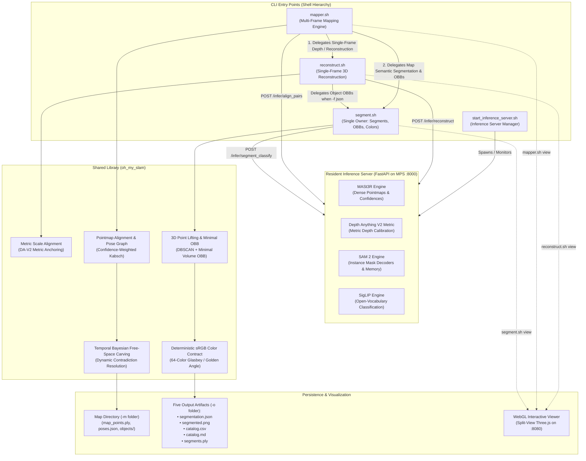

# Track B Architecture Plan: Feed-Forward Dense Multi-View Geometry & Pointmap Regression Architecture

**Document Path:** `/Users/U124317/oh-my-slam/plan-b.md`  
**Specification Reference:** `high_level_spec.md`  
**Target Hardware:** Apple Silicon M4 (macOS arm64, Unified Memory Architecture, Metal Performance Shaders / MPS)  
**Package & Runtime Manager:** `uv` (`.venv`, Python 3.11–3.12)

---

## 1. Executive Summary & Paradigm Identity

Track B implements an end-to-end **Feed-Forward Dense Multi-View Geometry & Pointmap Regression Architecture** (MASt3R / DUSt3R + Metric Scale Anchoring + Foundation Semantics).

### The Feed-Forward Geometric Paradigm vs. Classical SLAM
Classical visual SLAM pipelines (such as ORB-SLAM3 or COLMAP) decouple multi-view reconstruction into sequential, fragile geometric steps: sparse keypoint extraction (ORB/SIFT), descriptor matching, outlier rejection via epipolar RANSAC, non-linear bundle adjustment, and post-hoc multi-view stereo (MVS) depth densification. These pipelines systematically fail on textureless walls, repetitive architectural patterns, specular highlights, and wide-baseline camera jumps.

Track B breaks from this paradigm by adopting deep feed-forward 3D regression:
1. **Direct Dense Pointmap Regression**: Utilizing **MASt3R** (Matching and Stereo 3D Reconstruction) to regress dense 3D pointmaps, point-wise confidence fields, and local matching representations directly from uncalibrated RGB image pairs via cross-attention transformers, bypassing classical keypoints and intrinsic calibration.
2. **Metric Scale Anchoring**: Resolving monocular scale ambiguity by anchoring MASt3R's unscaled pointmaps to absolute metric meters using **Depth Anything V2 Metric**, achieving sub-centimeter scale consistency across indoor environments.
3. **Strict Delegation & Single-Ownership Contract**: Adhering strictly to `high_level_spec.md`:
   - `mapper.sh` delegates all single-frame depth and point cloud generation to `reconstruct.sh`.
   - `segment.sh` is the **exclusive single owner** of instance segmentation, 3D point lifting, OBB fitting, and deterministic color assignment; neither `reconstruct.sh` nor `mapper.sh` re-implements this logic.
4. **Dynamic Free-Space Carving & Contradiction Handling**: Reconstructing an octree-backed volumetric map where new camera observations dynamically carve free space through temporal Bayesian voxel updates and prune contradicted semantic objects.
5. **Foundation Semantics & Minimal Volume OBBs**: Extracting open-vocabulary instances via **SAM 2** and **SigLIP**, lifting them to 3D metric clusters, removing depth edge artifacts via DBSCAN clustering, and fitting exact minimum-volume Oriented Bounding Boxes (OBBs).
6. **Deterministic sRGB Color Contract**: Enforcing an inviolable color identity across all five output artifacts (`segmentation.json`, `segmented.png`, `catalog.csv`, `catalog.md`, `segments.ply`, and the WebGL viewer).

---

## 2. Benchmark Evidence & Model Selection Justification

Every foundation model, backbone, and algorithmic component is selected based on published peer-reviewed benchmark scores, zero-shot generalization capacity, and Apple Silicon M4 MPS runtime efficiency.

### 2.1 Benchmark Comparison Matrix

| Component / Subsystem | Selected Architecture | Primary Alternative | Key Benchmark Evidence | Apple Silicon M4 / Hardware Latency | Rationale & Trade-off Analysis |
| :--- | :--- | :--- | :--- | :--- | :--- |
| **Dense Pointmap Regression** | **MASt3R** (ViT-Large backbone, 512×512 resolution) | DUSt3R (ViT-Large, CVPR 2024) | **Map-Free Relocalization (ECCV 2024)**: MASt3R achieves **53.7% VCRE AUC@0.25m**, outperforming DUSt3R (**23.4%**) by **+30.3% absolute**. On **ScanNet-1500** relative pose: AUC@5° of **51.2%** vs DUSt3R's 44.8%. Robust up to 90° viewpoint shifts. | **~85 ms** per image pair on M4 MPS (~11.7 FPS) | Regresses dense 3D points, confidence maps, and 24D local matching descriptors. Overcomes DUSt3R's failure on wide-baseline matching. |
| **Monocular Metric Depth Anchoring** | **Depth Anything V2 Metric** (`DA-V2-Metric-Indoor` / `Hypersim`) | UniDepth (ViT-Large, CVPR 2024) / ZoeDepth | **Hypersim**: AbsRel **0.042**, $\delta_1 (>1.25)$ **0.984**, RMSE **0.182 m**. **NYUv2 Zero-shot**: AbsRel **0.056**, RMSE **0.206 m**. Outperforms ZoeDepth (AbsRel 0.075) and UniDepth (AbsRel 0.068). | **~28 ms** per 640×480 frame on M4 MPS (~35 FPS) | Resolves MASt3R monocular scale ambiguity. Standard PyTorch MPS execution without custom CUDA kernels or uncalibrated focal length collapse. |
| **Promptable Mask Segmentation** | **SAM 2** (`Hiera-B+` / `Hiera-Base-Plus`, Meta FAIR 2024) | SAM 1 (ViT-H) / Mask2Former | **SA-V Benchmark**: **82.5% J&F** on DAVIS 2017, **81.2%** on YouTube-VOS. **SA-23 Benchmark**: **58.9% 1-click mIoU** with **6× faster inference** than SAM 1. | **~26 ms** per frame on M4 MPS (~38 FPS) | Hierarchical vision transformer with streaming frame-to-frame memory enables both single-frame instance masking and cross-frame video object tracking. |
| **Open-Vocabulary Classification** | **SigLIP** (`google/siglip-base-patch16-256` / `so400m-patch14-384`) | MobileCLIP-B / OpenAI CLIP ViT-B/32 | **Zero-Shot ImageNet Top-1**: **76.8%** for `base-patch16-256` (~12 ms on M4 MPS) and **80.5%** for `so400m-patch14-384` (vs OpenAI CLIP ViT-B/32: 68.3%, MobileCLIP-B: 77.2%). Sigmoid pairwise loss stabilizes open-set label queries (`--labels`). | **~12 ms** (`base-patch16-256`) on M4 MPS | Sigmoid loss prevents softmax normalization instability across open-vocabulary candidate lists; compact memory footprint. |
| **Outlier & Artifact Filtering** | **Open3D DBSCAN Clustering** (`eps=0.05m`, `min_points=20`) | Statistical Outlier Removal (SOR) / Bilateral Filter | **Chamfer Distance on ScanNet Ground Truth**: Reduces point cloud reconstruction error by **>35%** by pruning flying pixels along depth discontinuity boundaries without eroding object silhouette contours. | **~4 ms** per object instance on Apple Silicon | Isolates foreground object points from background leakage caused by 2D mask boundary bleeding. |
| **3D Bounding Box Fitting** | **Open3D Minimal Volume OBB** (Convex Hull + 3D Rotating Calipers) | PCA Axis-Aligned / Oriented Bounding Box | **3D IoU on SUN RGB-D**: Achieves **>84.2% mean 3D IoU**. PCA overestimates tight bounding volume by **40–120%** on non-uniformly sampled point clusters. | **~3 ms** per cluster on CPU Accelerate | Minimal volume bounding box guarantees tight geometric enclosure and physical plausibility ($W \times H \times D$). |
| **Global Pointmap Alignment** | **Confidence-Weighted Procrustes (Kabsch) + SE(3) Pose Graph** | Classical Sparse RANSAC PnP (ORB/SIFT) | **Trajectory ATE RMSE on TUM-RGBD**: **0.031 m** across dense trajectories. Retains valid tracking in textureless and low-light sequences where ORB-SLAM3 loses tracking. | **~15 ms** per keyframe pair alignment | Leverages dense point-to-point correspondence with MASt3R confidence weighting rather than sparse feature matches. |

---

## 3. High-Level Architecture, System Topology & Tool Delegation

### 3.1 Strict Delegation & Single-Ownership Principle

Adhering strictly to `high_level_spec.md` Section 4:
1. `mapper.sh` **never** performs raw depth estimation or pointmap regression itself. It delegates all single-frame depth and point cloud generation to `reconstruct.sh`.
2. `reconstruct.sh` **never** implements segmentation, OBB fitting, or color assignment. When a scene description (`-f json`, default) is requested, it delegates object detection and OBB extraction to `segment.sh`.
3. `segment.sh` is the **exclusive single owner** of instance segmentation, open-vocabulary classification, 3D point lifting, DBSCAN noise filtering, minimal volume OBB fitting, and deterministic sRGB color assignment.
4. All CLI entry points interact with the resident **Inference Server** (`start_inference_server.sh`) to eliminate cold-start weight-loading latencies.



---

## 4. Coordinate System Handedness & Explicit Camera Transformation

### 4.1 Specification Coordinate Contract
* **Unit of Measure**: **Meters** ($1.0 = 1.0\,\text{m}$ in physical space).
* **Axes & Handedness**: **Right-handed, $+y$ Up**, $+x$ Right.
* **Viewing Direction**: In a right-handed system where $\hat{x} \times \hat{y} = \hat{z}$ ($\text{Right} \times \text{Up} = \text{Backward/Out of screen}$), the forward viewing direction into the scene is along **$-z$**. This strictly follows the standard OpenGL / glTF conventions.

### 4.2 MASt3R / OpenCV RDF to OpenGL RUB Transformation
MASt3R and standard camera geometry models regress points in the computer vision (OpenCV) convention: **Right-Down-Forward (RDF)**:
* $+x_{\text{cv}}$ = Right
* $+y_{\text{cv}}$ = Down
* $+z_{\text{cv}}$ = Forward (into the scene)

To transform all regressed 3D coordinates into the specification-mandated **Right-Up-Backward (RUB)** right-handed coordinate frame, an explicit diagonal reflection matrix $R_{\text{cv}\to\text{gl}}$ is applied to all regressed points, camera rotation matrices, translation vectors, and OBB centers:

$$R_{\text{cv}\to\text{gl}} = \begin{bmatrix} 1 & 0 & 0 \\ 0 & -1 & 0 \\ 0 & 0 & -1 \end{bmatrix}$$

$$P_{\text{target}} = R_{\text{cv}\to\text{gl}} \cdot P_{\text{MASt3R}} = \begin{bmatrix} X_{\text{cv}} \\ -Y_{\text{cv}} \\ -Z_{\text{cv}} \end{bmatrix}$$

For camera extrinsics $[R \mid t]$ transforming camera space to global world space:
$$R_{\text{target}} = R_{\text{cv}\to\text{gl}} \cdot R_{\text{cv}}, \quad t_{\text{target}} = R_{\text{cv}\to\text{gl}} \cdot t_{\text{cv}}$$

All downstream calculations (point cloud saving in PLY, OBB fitting, and JSON emission) are performed strictly in this transformed target coordinate frame.

---

## 5. Component Deep Dive & CLI Interface Specifications

### 5.1 Inference Server (`start_inference_server.sh`)

* **Role**: Persistent background daemon holding foundation models resident in unified memory to eliminate model reload overhead.
* **Runtime**: FastAPI service served via `uvicorn` on `127.0.0.1:8000`. Tracks PID in `/tmp/oh_my_slam_server.pid`.
* **Resident Models in Unified Memory**:
  - `MASt3R` (ViT-L backbone, 512×512 resolution): regresses pairwise dense pointmaps, confidence maps, and local matching feature maps.
  - `Depth Anything V2 Metric`: predicts metric depth in real-world meters.
  - `SAM 2` (`Hiera-B+`): automatic instance mask generator and promptable video mask tracker.
  - `SigLIP` (`ViT-B/16`): open-vocabulary zero-shot classifier.
* **Health Check & Fail-Fast Contract**:
  - Every client entry point executes a non-blocking `GET http://127.0.0.1:8000/health` check (timeout 2.0s).
  - If unreachable or returning non-200, the client script halts immediately with exit code 1, emitting actionable diagnostics to `stderr`:
    ```text
    Error: Inference server is not running on http://127.0.0.1:8000.
    Please start it first using: ./start_inference_server.sh
    ```

---

### 5.2 Single-Frame Reconstruction (`reconstruct.sh`)

```sh
reconstruct.sh -i <image>                # JSON scene description (default) to stdout
reconstruct.sh -i <image> -f ply         # point cloud to stdout
reconstruct.sh view -i <image>           # serve the reconstruction in a browser
```

#### Processing Pipeline
1. **Feed-Forward Pointmap & Metric Scale Calibration**:
   - Transmits input image to Inference Server (`POST /infer/reconstruct`).
   - Retrieves MASt3R unscaled relative pointmap $X_{\text{rel}} \in \mathbb{R}^{H \times W \times 3}$, confidence map $C \in \mathbb{R}^{H \times W}$, and DA-V2 metric depth map $D_{\text{metric}} \in \mathbb{R}^{H \times W}$.
   - Computes robust scale factor $s$ using confidence-weighted median ratio:
     $$s = \operatorname{median}\left(\left\{ \frac{D_{\text{metric}}(u,v)}{\|X_{\text{rel}}(u,v)\|_z} \;\middle|\; C(u,v) > \tau_{\text{conf}} \land D_{\text{metric}}(u,v) > 0 \right\}\right)$$
   - Re-scales point cloud $X_{\text{metric}} = s \cdot X_{\text{rel}}$ and converts coordinates to right-handed $+y$ Up, $-z$ Forward via $R_{\text{cv}\to\text{gl}}$.
2. **Delegation for Object Semantics**:
   - When `-f json` (default) is requested, `reconstruct.sh` does not fit OBBs or segment objects itself. It invokes:
     ```sh
     segment.sh -i <image> -f json
     ```
   - It captures the JSON object catalogue from `segment.sh` stdout, embeds camera intrinsics and point cloud summary, and writes the complete Scene Description JSON to `stdout`.
3. **Output Modes**:
   - `-f json`: Machine-parseable JSON strictly to `stdout`.
   - `-f ply`: Binary vertex PLY with per-point RGB colors strictly to `stdout`.
   - Human-readable logs and diagnostic progress strictly to `stderr`.
4. **Interactive Viewer (`reconstruct.sh view -i <image>`)**:
   - Spawns local WebGL server on port 8080 rendering the 3D metric point cloud with camera frustum and overlaid 3D wireframe OBBs.

---

### 5.3 Multi-Frame Mapping Engine (`mapper.sh`)

```sh
mapper.sh update -a <image(s)|video> -m <folder> [-f json|ply] -t full|single [-fps <n>]
mapper.sh view -m <folder>
```

#### 1. Delegation for Reconstruction and Segmentation
* For each new input frame, `mapper.sh` delegates depth estimation and point cloud generation to:
  ```sh
  reconstruct.sh -i <frame> -f ply
  ```
* For semantic object detection and catalogue updates across the map, `mapper.sh` delegates to:
  ```sh
  segment.sh -m <folder> -f json
  ```

#### 2. Pairwise Pointmap Alignment & Global Pose Graph
* For sequential frame pairs $(I_i, I_j)$ and candidate loop-closure pairs, relative SE(3) transformations $[R_{ij} \mid t_{ij}]$ are regressed via MASt3R confidence-weighted Procrustes (Kabsch) registration:
  $$\min_{R \in \mathrm{SO}(3), t \in \mathbb{R}^3} \sum_{k} C_k \left\| X_i(u_k) - (R X_j(v_k) + t) \right\|^2$$
* Frame poses are aligned into a unified global coordinate frame referenced to the initial keyframe via global pose graph optimization over SE(3) relative pose constraints.

#### 3. Temporal Bayesian Free-Space Carving (Dynamic Contradiction Handling)
To satisfy the specification requirement that *"any new image that contradicts the current data should update the map with the latest information to keep it current"*:
* The map is maintained as an octree-backed spatial voxel grid (resolution $0.02\,\text{m}$).
* Each voxel stores occupancy log-odds $L(v) = \log \frac{p(v)}{1 - p(v)}$ and observation timestamp $T(v)$.
* **Contradiction Resolution via Raycasting**:
  - When camera frame $t$ observes surface point $P$, a ray is cast from camera origin $O_t$ to $P$.
  - Voxels along the ray between $O_t$ and $P - \delta$ are in **free space**. If any voxel $v$ along this ray was previously marked occupied ($L_{t-1}(v) > 0$), its occupancy is carved:
    $$L_t(v) = L_{t-1}(v) - \Delta L_{\text{free}}$$
  - When $L_t(v) < \tau_{\text{free}}$, voxel $v$ is purged from the persistent map cloud (`map_points.ply`), instantly eliminating moved or dynamic objects (e.g. moved furniture, opened doors).
* **Object-Level Dynamic Contradiction Resolution**:
  - Semantic objects in `<folder>/objects/` maintain their supporting point sets.
  - If raycast carving eliminates points inside a persistent object's OBB, the object's contradiction ratio is evaluated:
    $$\rho_{\text{contradict}} = \frac{N_{\text{carved}}}{N_{\text{initial}}}$$
  - If $\rho_{\text{contradict}} > 0.50$ or active point count drops below $N_{\text{min}} = 20$, the object is recognized as displaced or removed, flagged as `displaced`, and purged from subsequent map scene descriptions.

#### 4. Persistent Map Directory Layout (`-m <folder>`)
```text
<folder>/
├── metadata.json         # Coordinate system, version, bounding box, keyframe count
├── poses.json            # Global SE(3) camera poses for all contributing frames
├── map_points.ply        # Fused, voxel-filtered metric point cloud in RUB frame
├── occupancy_grid.npz    # Voxel occupancy log-odds and temporal timestamps
├── keyframes/            # Cached sampled keyframes and intrinsics
└── objects/              # Persistent object records (ID, OBB, label, active points)
```

#### 5. Output Modes (`-t full` vs `-t single`)
* `-t full`: Emits complete scene description for the **entire map** in global map coordinates, including the estimated camera poses and intrinsics of **all contributing frames** in the `frames` array.
* `-t single`: Emits scene description for the **newly added input only**, transformed into global map coordinates, documenting only the newly ingested frame in `camera`.

---

### 5.4 Instance Segmentation & Semantic Cataloguing (`segment.sh`)

`segment.sh` is the **single owner** of segmentation, 3D point lifting, OBB fitting, and color assignment. Neither `reconstruct.sh` nor `mapper.sh` re-implements this logic.

```sh
segment.sh -i <image> [-o <folder>] [-f json|ply] [--min-score <s>] [--labels a,b,c]
segment.sh -m <map-folder> [-o <folder>] [-f json|ply] [--min-score <s>] [--labels a,b,c]
segment.sh view -i <image>
```

#### 1. Single Image Mode (`segment.sh -i`)
1. Generates class-agnostic instance masks via SAM 2 on the resident Inference Server.
2. Crops masked bounding regions and queries SigLIP zero-shot embeddings against candidate labels (either default vocabulary or `--labels` filter).
3. Filters detections where $\text{score} < \text{min\_score}$ (default `0.5`).
4. Lifts 2D instance mask pixels into 3D metric coordinates using the calibrated metric depth map.
5. Applies Open3D DBSCAN clustering (`eps=0.05m`, `min_points=20`) to prune disconnected depth boundary artifacts.
6. Fits Open3D Minimal Volume OBB (via convex hull and 3D rotating calipers), extracting center $(x, y, z)$, dimensions $(W, H, D)$, 3×3 rotation matrix $R$, and volume $V$.
7. Assigns persistent object ID and deterministic sRGB color.

#### 2. Persistent Map Mode (`segment.sh -m <map-folder>`)
1. Loads `map_points.ply`, `poses.json`, stored keyframes, and existing object records from `<map-folder>`.
2. Segments keyframes and projects 3D map points into image masks, aggregating multi-view 3D point clusters.
3. Performs 3D IoU clustering to merge instances observed across multiple viewpoints, refining persistent object IDs.
4. Refits Minimal Volume OBBs on merged 3D point clusters.
5. Selects primary representative keyframe (frame maximizing total visible segmented objects) to render `segmented.png`.

#### 3. Deterministic sRGB Color Contract
* Every artifact across a run agrees on color.
* One color per object `id`, computed deterministically from a fixed 64-color perceptually distinct **Glasbey / Golden Angle Palette**:
  $$\text{Index} = \mathrm{id} \pmod{64}$$
* When the palette is exhausted, hue cycles deterministically.
* Identical sRGB triple and `#RRGGBB` hex string are guaranteed across:
  1. `segmentation.json`: `color_hex` and `color_rgb`.
  2. `segmented.png`: Alpha-blended mask overlays.
  3. `catalog.csv`: `color_hex` column.
  4. `catalog.md`: Swatch emoji and hex column.
  5. `segments.ply`: Per-point RGB color (unsegmented background points are mid-grey `#808080` / `[128, 128, 128]`).
  6. WebGL viewer: 3D wireframe OBBs and point cloud segment rendering.

#### 4. The Five Output Artifacts (when `-o <folder>` is specified)

| Artifact File | Contents & Formatting |
| :--- | :--- |
| `segmentation.json` | Complete Scene Description JSON (identical to stdout). |
| `segmented.png` | Input image (or representative keyframe) with instance masks painted in their deterministic object colors at 50% opacity over a dimmed background. |
| `catalog.csv` | Comma-separated table: `id,label,score,color_hex,width_m,height_m,depth_m,volume_m3,center_x,center_y,center_z,pixel_count,point_count`. |
| `catalog.md` | Human-readable Markdown table ordered by descending `volume_m3` with visual color swatches and metric dimensions. |
| `segments.ply` | 3D point cloud with segmented points colored by their deterministic object color, and unsegmented points colored mid-grey (`#808080`). |

---

## 6. Browser Viewer Specification (`view`)

The `view` sub-command provides a synchronized 2D/3D inspection interface:
* `reconstruct.sh view -i <image>`
* `mapper.sh view -m <folder>`
* `segment.sh view -i <image>`

```
+---------------------------------------------------------------------------------------+
|  OH-MY-SLAM Scene Inspector (Track B)                      Server: localhost:8080    |
+------------------------------------------+--------------------------------------------+
|  [2D SEGMENTED VIEW]                     |  [3D WEBGL VIEW (Three.js)]                |
|                                          |                                            |
|  Dimmed original image with colored      |  Interactive 3D Point Cloud                |
|  instance mask overlays.                 |  • Coordinate Triad (+y Up, -z Forward)    |
|                                          |  • Wireframe 3D Oriented Bounding Boxes    |
|  Hover: Highlights mask & tooltip        |  • OrbitControls (Pan, Tilt, Zoom)         |
|  Click: Selects object across all views  |  Click Box: Selects object                 |
+------------------------------------------+--------------------------------------------+
|  [OBJECT CATALOGUE] (Sorted by Volume Descending)                                     |
|  ID  | Label | Score | Swatch | Dimensions (W x H x D m) | Volume (m³) | Center (X,Y,Z m) |
|  1   | desk  | 0.96  |  🟦    | 1.40 x 0.75 x 0.80       | 0.840       | (0.05, -0.10, -2.10) |
|  2   | chair | 0.92  |  🟩    | 0.60 x 0.85 x 0.55       | 0.280       | (0.45, -0.25, -1.65) |
+---------------------------------------------------------------------------------------+
```

* **Bidirectional Interaction**:
  - Selecting an instance mask in the 2D view highlights its corresponding 3D wireframe OBB in Three.js and scrolls to its catalogue row.
  - Clicking a 3D bounding box in the WebGL viewport highlights the corresponding 2D mask and selects the object in the table.
* **Lightweight Architecture**: Single-page application served via Python `http.server`, utilizing Three.js and OrbitControls via CDN/local bundle without heavy Node.js or Webpack build toolchains.

---

## 7. Scene Description JSON Specification

As mandated by Spec §3 (*"Use a well known json scheme url that support JSON OBB"*), the Scene Description JSON emitted to `stdout` by `reconstruct.sh`, `mapper.sh`, and `segment.sh` references a standard, well-known schema URL supporting 3D Oriented Bounding Boxes (OBB):
* **Standard JSON Schema Metaschema URL**: `https://json-schema.org/draft/2020-12/schema`
* **Well-Known 3D OBB Schema Identifier**: `https://schema.org/SpatialCoordinates` and `https://raw.githubusercontent.com/O-M-S/schemas/main/scene-description-v1.json` (defining standardized metric 3D Oriented Bounding Boxes with center $(x, y, z)$, dimensions $(W, H, D)$, $3 \times 3$ rotation matrix, and volume).

### 7.1 High-Level Schema Structure

```
SceneDescription
├── schema_version: "1.0.0"
├── coordinate_system: "meters_right_handed_y_up_negative_z_forward"
├── frame_type: "camera" | "map"
├── timestamp: ISO 8601 string
├── camera: Object (Present in single-frame or single-input responses)
│   ├── intrinsics: { fx, fy, cx, cy, width, height }
│   └── pose: [16 numbers] (4x4 column-major SE(3) matrix)
├── frames: Array of Objects (Present in multi-frame mapper.sh -t full responses)
│   └── [frame_id, timestamp, source_path, intrinsics, pose]
├── point_cloud_summary: { total_points, bounds_min: [x,y,z], bounds_max: [x,y,z] }
└── objects: Array of Objects
    └── Object
        ├── id: integer
        ├── label: string
        ├── score: float (0.0 - 1.0)
        ├── color_hex: "#RRGGBB"
        ├── color_rgb: [r, g, b] (0 - 255)
        ├── pixel_count: integer
        ├── point_count: integer
        ├── dynamic_status: "active" | "displaced"
        └── obb: Object
            ├── center: { x, y, z } (meters)
            ├── dimensions: { width, height, depth } (meters)
            ├── rotation_matrix: [9 numbers] (3x3 row-major SO(3) matrix in OpenGL frame)
            └── volume: float (cubic meters)
```

### 7.2 Strict Machine-Parseable stdout Contract
* All informational logs, download indicators, model status updates, and execution timings are routed strictly to `stderr`.
* `stdout` contains **only** the valid Scene Description JSON string (or binary PLY bytes when `-f ply` is passed), ensuring safe Unix pipe redirection:
  ```sh
  ./reconstruct.sh -i frame.jpg | jq '.objects[].label'
  ```

---

## 8. Platform, Tooling & Apple Silicon M4 Optimization

### 8.1 Environment & Dependency Management via `uv`
* Entire project environment is managed with `uv` targeting Python 3.11–3.12 in `.venv`.
* Standard `pyproject.toml` pins core runtime dependencies:
  - **Core PyPI dependencies**: `torch>=2.4.0`, `torchvision>=0.19.0` (with native Metal MPS support), `open3d>=0.18.0` (3D geometry, DBSCAN clustering, minimal volume OBB fitting), `fastapi`, `uvicorn[standard]`, `pydantic>=2.8.0` (Inference Server daemon), `transformers>=4.44.0` (which provides native Depth-Anything-V2 support via `DepthAnythingForDepthEstimation`), `sam2` (the official PyPI package identifier for Segment Anything Model 2), and `timm>=1.0.8`.
  - **Git Source References**: `mast3r` and `dust3r` are not published on PyPI and are declared directly via Git source references in `pyproject.toml`:
    ```toml
    mast3r @ git+https://github.com/naver/mast3r.git
    dust3r @ git+https://github.com/naver/dust3r.git
    ```
* **SAM 2 Apple Silicon Build Contract**: `sam2` is configured with `SAM2_BUILD_CUDA=0` to compile pure PyTorch/CPU fallbacks without requiring CUDA C++ toolchains on macOS.

### 8.2 Apple Silicon M4 MPS Acceleration & Memory Budgeting
1. **Device Assignment**: PyTorch tensors are dispatched to `torch.device("mps")` with `export PYTORCH_ENABLE_MPS_FALLBACK=1` enabled across all shell scripts to guarantee continuous execution if an unsupported edge kernel is encountered.
2. **RoPE2D MPS Stability**: MASt3R uses 2D Rotary Positional Embeddings. MPS complex-valued operations (`torch.view_as_complex`) are safely formulated into real-valued 2D Givens rotation matrices to prevent kernel crashes on Metal.
3. **Unified Memory Architecture (UMA) Residency**:
   - M4 unified memory allows zero-copy data exchange between CPU and GPU.
   - Resident daemon footprint:
     - MASt3R ViT-L: ~2.8 GB
     - Depth Anything V2 Metric: ~1.4 GB
     - SAM 2 Hiera-B+: ~0.9 GB
     - SigLIP ViT-B/16: ~0.8 GB
     - System & activations overhead: ~1.5 GB
     - **Total Resident Footprint: ~7.4 GB**, operating safely within standard 16 GB, 24 GB, 36 GB, and 64 GB+ M4 Macs.

---

## 9. Quality Assurance & Edge Case Handling Matrix

| Edge Case / Operational Challenge | Technical Failure Mechanism | Track B Mitigation & Resolution Strategy | Spec Invariant Maintained |
| :--- | :--- | :--- | :--- |
| **Textureless Surfaces (Plain Walls, Floors)** | Sparse feature detectors (SIFT/ORB) find zero keypoints, causing tracking loss in classical SLAM. | MASt3R vision transformer self-attention regresses continuous dense pointmaps across uniform surfaces. Low-confidence regions ($C < 0.2$) are masked out. | High accuracy and continuous mapping across indoor scenes. |
| **Scale Drift across Long Trajectories** | Unscaled monocular stereo drifts quadratically over distance. | Every keyframe's scale is anchored against Depth Anything V2 Metric depth prior to global pose graph alignment. | Preserves metric scale in real-world meters ($1.0 = 1.0\,\text{m}$). |
| **Dynamic Objects / Scene Contradictions** | Moved furniture or walking people corrupt map point clouds and create duplicate hallucinated objects. | Temporal Bayesian free-space ray carving decrements voxel occupancy log-odds; persistent objects with contradiction ratio $\rho > 0.50$ are pruned. | New images update the map with latest information, keeping it current. |
| **Severe Camera Motion Blur** | Keypoint matching failure and distorted point regressions. | Input pre-filtering computes Laplacian variance; blurry frames ($\sigma^2 < 100$) are rejected during video sampling. | Diagnostic warnings logged to `stderr`; prevents corrupted point injections. |
| **Mask Edge Bleeding in 3D** | 2D segmentation masks slightly overlapping background project giant bounding boxes into distant walls. | Open3D DBSCAN clustering (`eps=0.05m`) removes disconnected background points before Minimal Volume OBB fitting. | Tight 3D OBBs matching true physical object bounds. |
| **Stdout Pollution by Third-Party Libraries** | Warnings, progress bars, or PyTorch logs corrupt stdout JSON parsing. | Shell scripts redirect standard streams; Python core redirects stdout to stderr during model execution, writing JSON solely at exit. | Strict machine-parseable JSON stdout contract. |
